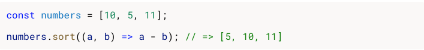

# COLOR-MASH
---
Color-Mash is a game that practises the players mental agility in an entertaining and competetive way.
Color-Mash is a fully responsive javascript game that can be played in all popular browsers.
The target audience for this game is anyone who wants to improve their mental agility or just love games.
 

## Features
---

## Existing Features
---
### Header 
- Logo:
    - The logo and game title is the first thing the visitor sees. The colored shadow effects gives a hint to the visitor that the game is about colors.
- Game statistics and time section:
    - Below the game title you can see a devided section of the header that contains the following:
        - **Time:** shows "0" before the visitor starts a new game. After starting a new game a clock starts to count down from 20 seconds. When the clock reaches 0 the text changes to game over.
        - **Score:** shows the player how many scores that have been achived during the running game. A correct answer gives one point and an error will deduct one point. After the time is up it will still show the players score from the previous game until a new game is started.
        - **High score:** shows the highest score from previous games. This gives the player the oportunity to keep track of the best score achived so the player knows what score to try and beat.
- Instructions popup button:
    - The instructions popup button is located in a fixed position in the top left corner of the screen so the visitor easily can get additional    instructions on how to play the game. The button is in another color so the visitor clearly can see it.

---
- Instructions popup:
    - The instructions popup gives additional explanations on how to play the game and also provides a .gif image that shows how the game is played. The window can be closed on the button on top of the screen. This helps the visitors that need more explaning to understand the rules of the game.

---
### Game section
- **Startbutton:** starts a new game which will start the count down clock, hide the start new game button, show the answer buttons and present a new question. The start new game buttton is centerde and big in size so it is obious to the visitor how to start a new game. When the game is over an alert message will tell the user that time is up and the final score of the game.
- **Instructions:** shows a simple and short explenation of how to play the game. More instructions can be found in the top left corner of the screen. This gives a clean look to the game section for players that don´t need further guidance.
- **Questions section:**
    - **Meaning and top word:** shows the word "Meaning" and the top word just below so the visitor easily can connect the meaning of the top word with the meaning of that word. 
    - **Word Color and bottom word:** shows the word "Word Color" and the bottom word just above so the visitor easily can connect the color of the bottom word.

- **Answer Buttons:** The answer buttons "YES" and "NO" appear under the questions section after the game begins. When pressed a check mark appears if the answer is correct and a cross appears if the answer is wrong. Also the words changes after a button press. The buttons are large so they can easily can be pressed even on smaller screens and makes it possible for the visitor to give an answer to the question.

## Features Left To Implement
---
- Longer high score list so the player can see the best three scores instead of soley the best score. 

## Testing
---

### Validator Testing

- HTML
    - No errors were found when running the official w3c validator LINK.
- CSS
    - No errors were found when running the official (Jigsaw) validator. LINK
- JavaScript
    - No errors were found when running the official Jshint validator. LINK
        - The following metrics were returned:
            - There are XX functions in this file.
            - Function with the largest signature takes XX arguments, while the median is XX.
            - Largest function has 10 statements in it, while the median is XX.
            - The most complex function has a cyclomatic complexity value of 4 while the median is XX.

### Fixed Bugs
- Could not get the if statement in function "checkCorrectAnswer(type)" to work.
    - FIX: The arrays for words is in uppercase letters but the colors returned by the "document.getElementById("bottomWord").style.color;" returned lowercase letter. To get them to compare I first needed to make the words from array to lowercase letters before comparing them in the if statement.
- Could not get high score array to sort in the correct way.
    - FIX: I used the .sort() method to sort the array with the smallest number first. Then I took the last index of the array. I later found that sort() first converted the values to a string value and then tried to sort them. I found the solution on this site: [Solution to bug](https://dmitripavlutin.com/javascript-array-sort-numbers/)

    

    

- Could not keep the check and cross mark to be centered in the questions section when I changed screen size.
    - FIX: To get the check and cross mark to show in front of the questions section I had to make their position absolute. To keep them centered when changing screen size I needed to add transform: translate(-50% 50%), bottom: 50%, left 50% to their style properties.
### Unfixed Bugs
 

## Deployment
---
- The site was deployed to GitHub Pages the steps were:
    - Go to settings in your GitHub repository, click the pages section in the left menu.
    - From the sources section, press the drop down menu and select main branch.
    - The link to the site is generated and can be found [here](https://mtssamsioe.github.io/Color-Mash/).
## Credits
---

### Content
- Instructions and some of the code was taken from this site: [Stack overflow - Foolish Ferret](https://www.codegrepper.com/code-examples/javascript/add+countdown+time+to+game+javascript)
- The colours and instructions for the title shadow effect was taken from: [We Learn Code](https://welearncode.com/rainbow-text/)
- Instructions to solve bug of centered object with position absolute I found here: [Medium manisha Basra](https://medium.com/front-end-weekly/absolute-centering-in-css-ea3a9d0ad72e)
- Instructions how to make a popup box I found here: [w3 Schools](https://www.w3schools.com/howto/howto_css_modals.asp)
- XX  Solution to bug fix on .sort() method sorting numbers alphabetical I found here: [Dimitri Pavlutin](https://dmitripavlutin.com/javascript-array-sort-numbers/)

- Instructions on how to get the check and cross mark to disappear after an error of a correct answer I found here: [w3 Schools](https://www.w3schools.com/jsref/met_win_settimeout.asp)

### Media
- Picture of check mark and cross are from: google images.
- .Gif image in explanation popup is from: [Adobe](https://www.adobe.com/express/feature/video/convert/video-to-gif).

## Other General Project Advice
---

